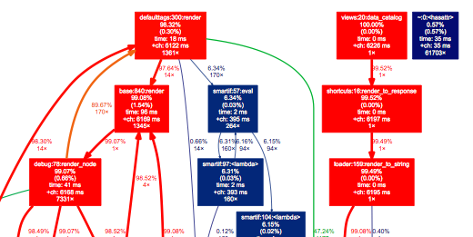

# Profiler Middleware

Profiler, based on https://djangosnippets.org/snippets/186, et. al. 

For each request, it dumps the profiler's stats object to the filesystem for later examination. 

Seth Hill 23-Sep-2014

## Requirements

I'm using Python 2.7 and Django 1.7. 

## Installation

    $ pip install good-profiler-middleware

Add `good.profiler.Middleware` to `MIDDLEWARE_CLASSES` in your settings.py like so:

    MIDDLEWARE_CLASSES = (
        'good.profiler.Middleware',
        ...
    )

The profiler will start recording as soon as it's called, so it is often convenient to place it first in the middleware stack. 

Add the following to settings.py (optional):

    # Profiler output goes in this directory. Make sure the web server has write 
    # permissions. If not specified, uses /tmp
    PROFILER_DUMP_PATH = '/path/to/some/dir'

## Usage

For each request, the middleware will create a stats file in the `PROFILER_DUMP_PATH`, named `DD-MMM-YYYY_HH-MM-SS.µS_METHOD.stats`. 

For example, `23-Sep-2014_00-41-24.1411432884_GET.stats`.

This stats file is created with [`cProfile.dump_stats()`](https://docs.python.org/2/library/profile.html#profile.Profile.dump_stats). This file can then be examined later using the [`Stats`](https://docs.python.org/2/library/profile.html#the-stats-class) 

### When profiling happens

The profiler will create a stats file for every request, except: 

* Requests containing an HTTP_REFERER are ignored. This (should) keep profiling localized to a single view function. Without this (and when running under the development server), the middleware tends to create huge numbers of stats files, and it can be difficult to find the right one. 

* If settings.DEBUG is False. This is not something that you would necessarily want to run on a production server. The exception to this is when you're logged in as a django super user. 

All of this is configured within the `should_profile()` function. 

### Analysis with pstats

An example transcript, sorted by number of calls:

    $ python -m pstats 23-Sep-2014_00-41-24.1411432884_GET.stats
    Welcome to the profile statistics browser.
	23-Sep-2014_00-41-24.1411432884_GET.stats% sort ncalls
	23-Sep-2014_00-41-24.1411432884_GET.stats% stats 5
    Mon Sep 22 17:41:03 2014    23-Sep-2014_00-41-03.1411432863_request_GET.stats

             14444 function calls (14344 primitive calls) in 0.053 seconds

       Ordered by: call count
       List reduced from 381 to 5 due to restriction <5>

       ncalls  tottime  percall  cumtime  percall filename:lineno(function)
         1276    0.000    0.000    0.000    0.000 {method 'append' of 'list' objects}
         1098    0.000    0.000    0.000    0.000 {isinstance}
          900    0.000    0.000    0.000    0.000 {method 'startswith' of 'unicode' objects}
          461    0.000    0.000    0.000    0.000 {method 'pop' of 'list' objects}
          419    0.000    0.000    0.000    0.000 {len}

And sorted by cumulative time: 

	23-Sep-2014_00-41-24.1411432884_GET.stats% sort cumtime
	23-Sep-2014_00-41-24.1411432884_GET.stats% stats 5
	Mon Sep 22 17:41:03 2014    23-Sep-2014_00-41-03.1411432863_request_GET.stats
	
	         14444 function calls (14344 primitive calls) in 0.053 seconds
	
	   Ordered by: cumulative time
	   List reduced from 381 to 5 due to restriction <5>
	
	   ncalls  tottime  percall  cumtime  percall filename:lineno(function)
	        1    0.000    0.000    0.053    0.053 xxx/views.py:20(data_catalog)
	        1    0.000    0.000    0.032    0.032 xxx/django/shortcuts.py:16(render_to_response)
	        1    0.000    0.000    0.032    0.032 xxx/django/template/loader.py:159(render_to_string)
	        1    0.000    0.000    0.032    0.032 xxx/django/template/loader.py:139(get_template)
	        1    0.000    0.000    0.032    0.032 xxx/django/template/loader.py:118(find_template)
	        
[Stefaan Lippens](http://stefaanlippens.net/python_profiling_with_pstats_interactive_mode) has a nice discussion of pstats. 
	        

### Analysis with DOT

Sometimes a graphical view is better:

->  <-

This is created with [Gprof2Dot](https://code.google.com/p/jrfonseca/wiki/Gprof2Dot), a fantastic tool which converts the output from several different profilers into a DOT file for view in graphviz. 

#### Generating DOTs from a folder of stats files

I have a simple shell script that I store in my dumps folder that converts all of the stats files into DOT: 

	for i in `ls -1 *stats`
	do
		gprof2dot.py --show-samples -f pstats   "$i" -o "${i%.*}.dot"
	done

